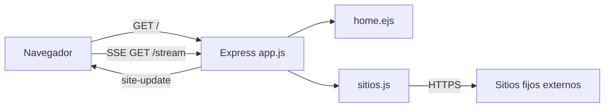

# Arquitectura

Última revisión documental: 2026-09-10. Estado: reconstruido desde implementación.

Arquitectura mínima en tres responsabilidades mezcladas parcialmente: `app.js` inicia Express y controla HTTP; `sitios.js` define configuración y sondeo Axios; `home.ejs` renderiza y contiene lógica cliente para filtros, gráficos y SSE. `public/` se expone estáticamente.

No hay cola, cron, almacenamiento, worker, API REST versionada ni health check. El CI histórico no coincide con scripts actuales: configura Node 16 y ejecuta `npm run build`, que no existe.
